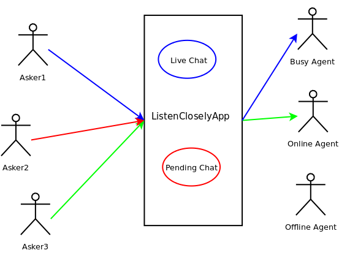
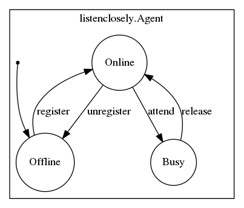
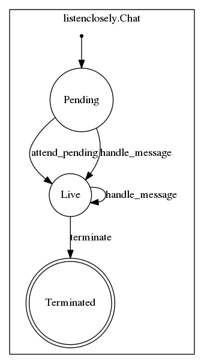

========
Usage
========

    
Then use it in a project::

    import listenclosely
    
Add it to django apps and migrate::

	INSTALLED_APPS = [
		...
    	'listenclosely',
    	...
	]
	python manage.py migrate
	
Select, install and configure service backend ::

	LISTENCLOSELY_MESSAGE_SERVICE_BACKEND = "listenclosely_telegram.service.TelegramMessageServiceBackend"
	
Define your agent strategy or define your own::

	LISTENCLOSELY_AGENT_STRATEGY = 'listenclosely.strategies.first_free.FirstFreeAgentStrategy'

Add step to your celery app::

	from listenclosely.celery import ListenCloselyAppStep
	app.steps['worker'].add(ListenCloselyAppStep)
	
Start your celery app usign gevent::

	celery --app=demo_app.celery:app worker -P gevent 

Call listen task or define a celery scheduler to execute::
	
	from listenclosely import tasks
	tasks.listen.delay()
	
**NOTE:** listenclosely comes with a demo with celery configuration example. 

How it works
---------------

* Asker1 is chatting with the Busy Agent
* Asker2 try to chat but no free Agent was free so is waiting with a Pending chat to be attended by an agent
* Asker3 is opening a chat and Online Agent will be assigned to the chat

State machines of *Agent* and *Chat*:

